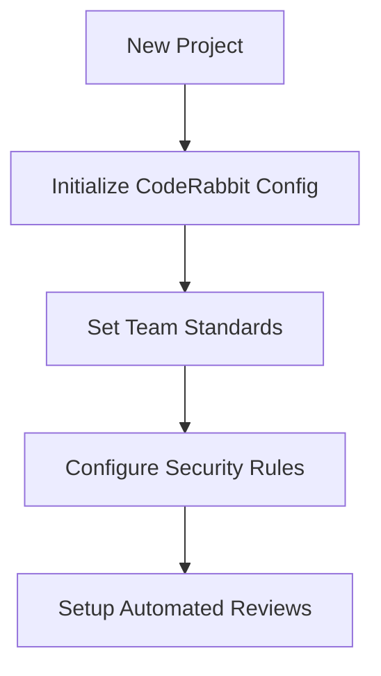
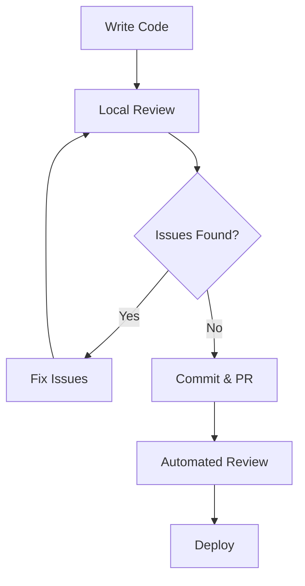
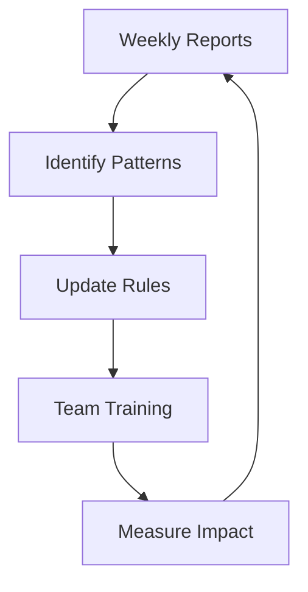

# CodeRabbit MCP Server - Complete Usage Documentation

## Table of Contents

1. [Overview](#overview)
2. [Use Cases](#use-cases)
3. [Integration Guide](#integration-guide)
4. [Agentic Coding Workflows](#agentic-coding-workflows)
5. [IDE Integrations](#ide-integrations)
6. [Advanced Scenarios](#advanced-scenarios)
7. [Best Practices](#best-practices)
8. [Troubleshooting](#troubleshooting)

---

## Overview

The CodeRabbit MCP Server transforms CodeRabbit AI from a simple PR reviewer into a powerful coding assistant that can be integrated into any development workflow. Through the Model Context Protocol (MCP), it enables AI agents and development tools to automatically request code reviews, generate reports, and configure review settings.

### Key Benefits

- **Proactive Code Review**: Get feedback before committing code
- **Automated Quality Assurance**: Integrate reviews into CI/CD pipelines
- **Intelligent Code Analysis**: Leverage CodeRabbit's AI for security, performance, and style checks
- **Seamless Workflow Integration**: Works with Claude Desktop, Cursor, VS Code, and terminal tools

---

## Use Cases

### 1. 🔍 **Pre-Commit Code Review**

**Scenario**: You're working on a new feature and want to get feedback before creating a pull request.

**Workflow**:
```typescript
// Request analysis of current changes
{
  "tool": "analyze_pull_request",
  "arguments": {
    "repository": "my-org/my-project",
    "pullRequestNumber": 456,
    "reviewInstructions": "Focus on security vulnerabilities and performance issues"
  }
}
```

**Benefits**: Catch issues early, improve code quality, learn best practices.

### 2. 📊 **Development Team Reports**

**Scenario**: As a team lead, you need weekly reports on code review activities and quality metrics.

**Workflow**:
```typescript
// Generate comprehensive team report
{
  "tool": "create_custom_report",
  "arguments": {
    "template": "Weekly team productivity report including PR reviews, security findings, and code quality trends",
    "dateRange": {
      "from": "2024-06-21",
      "to": "2024-06-28"
    },
    "filters": {
      "repositories": ["frontend-app", "backend-api", "shared-utils"],
      "authors": ["alice", "bob", "charlie"],
      "includeOnlyMerged": true
    }
  }
}
```

**Benefits**: Track team progress, identify trends, make data-driven decisions.

### 3. 🛠️ **Project Onboarding**

**Scenario**: New team member needs to understand project coding standards and review configuration.

**Workflow**:
```typescript
// Configure project-specific review settings
{
  "tool": "configure_review_settings",
  "arguments": {
    "repository": "my-org/new-project",
    "configuration": {
      "pathInstructions": [
        {
          "path": "**/*.ts",
          "instructions": "Follow company TypeScript style guide. Ensure proper error handling and type safety."
        },
        {
          "path": "tests/**/*",
          "instructions": "Verify test coverage and meaningful assertions."
        }
      ],
      "tools": {
        "astGrep": {
          "essentialRules": true,
          "packages": ["company/security-rules", "company/style-guide"]
        }
      }
    }
  }
}
```

**Benefits**: Consistent code quality, faster onboarding, automated guidance.

### 4. 🔐 **Security-First Development**

**Scenario**: Working on a payment processing feature that requires rigorous security review.

**Workflow**:
```typescript
// Security-focused analysis
{
  "tool": "analyze_pull_request",
  "arguments": {
    "repository": "fintech-app/payment-service",
    "pullRequestNumber": 789,
    "reviewInstructions": "Perform comprehensive security analysis. Check for: SQL injection, XSS vulnerabilities, authentication bypasses, data exposure, input validation, and secure API practices."
  }
}
```

**Benefits**: Early security issue detection, compliance assurance, risk mitigation.

### 5. 📈 **Performance Optimization**

**Scenario**: Optimizing a slow API endpoint and need expert analysis on performance improvements.

**Workflow**:
```typescript
// Performance-focused review
{
  "tool": "send_review_command",
  "arguments": {
    "command": "analyze performance bottlenecks and suggest optimizations",
    "context": "This endpoint handles 10k+ requests per minute. Focus on database queries, caching strategies, and algorithmic improvements.",
    "targetFiles": ["src/api/users.ts", "src/services/userService.ts", "src/db/queries.ts"]
  }
}
```

**Benefits**: Expert performance insights, optimization suggestions, scalability improvements.

---

## Integration Guide

### Claude Desktop

Claude Desktop provides the most seamless integration experience:

#### 1. Configuration
```json
{
  "mcpServers": {
    "coderabbit": {
      "command": "node",
      "args": ["/path/to/coderabbit-mcp-server/dist/MCPServer.js"],
      "env": {
        "CODERABBIT_API_KEY": "cr-your-api-key-here"
      }
    }
  }
}
```

#### 2. Usage Examples

**Interactive Code Review**:
```
Hey Claude, can you analyze my latest pull request #123 in the my-app/frontend repository? Focus on React best practices and performance.
```

**Configuration Management**:
```
Please configure CodeRabbit for our new TypeScript project. We want strict type checking, security rules, and performance monitoring.
```

**Report Generation**:
```
Generate a summary report of all code review activities from last week for the backend team.
```

### Warp Terminal

Warp's Agent Mode enables direct terminal integration:

#### 1. Setup
```bash
# Start the MCP server
npm start

# Use in Warp Agent Mode
@agent analyze the current branch changes using CodeRabbit
```

#### 2. Terminal Workflows

**Pre-commit Check**:
```bash
# Before committing
@agent "Please review my current changes using CodeRabbit. Focus on security and code quality."

# After getting feedback
git add .
git commit -m "feat: implement user authentication with security improvements"
```

**Branch Analysis**:
```bash
# Compare branches
@agent "Analyze differences between feature/auth and main using CodeRabbit"
```

### Cursor

Cursor's AI capabilities can be enhanced with CodeRabbit integration:

#### 1. Setup via Extensions
Create a Cursor extension that communicates with the MCP server:

```typescript
// cursor-coderabbit-extension/src/extension.ts
import { commands, window } from 'vscode';

export function activate(context: vscode.ExtensionContext) {
  let disposable = commands.registerCommand('coderabbit.analyzeFile', async () => {
    const activeEditor = window.activeTextEditor;
    if (activeEditor) {
      // Send file to CodeRabbit MCP server
      const analysis = await callMCPServer('analyze_current_file', {
        filePath: activeEditor.document.fileName,
        content: activeEditor.document.getText()
      });
      
      // Display results
      window.showInformationMessage(analysis);
    }
  });
  
  context.subscriptions.push(disposable);
}
```

#### 2. Cursor Chat Integration
```
@coderabbit Please review this React component for best practices and potential security issues.

@coderabbit Generate a configuration for our TypeScript project that enforces strict typing and performance monitoring.
```

### VS Code

#### 1. Extension Development
```typescript
// vscode-coderabbit/src/extension.ts
import * as vscode from 'vscode';
import { MCPClient } from './mcpClient';

export function activate(context: vscode.ExtensionContext) {
  const mcpClient = new MCPClient('http://localhost:3000');
  
  // Command: Analyze current file
  vscode.commands.registerCommand('coderabbit.analyzeFile', async () => {
    const editor = vscode.window.activeTextEditor;
    if (editor) {
      const result = await mcpClient.analyzeFile(editor.document);
      vscode.window.showInformationMessage(result);
    }
  });
  
  // Command: Configure project
  vscode.commands.registerCommand('coderabbit.configureProject', async () => {
    const config = await vscode.window.showInputBox({
      prompt: 'Enter project configuration details'
    });
    
    if (config) {
      await mcpClient.configureProject(config);
    }
  });
}
```

#### 2. Workspace Integration
```json
// .vscode/settings.json
{
  "coderabbit.autoReview": true,
  "coderabbit.reviewOnSave": true,
  "coderabbit.securityFocus": true
}
```

---

## Agentic Coding Workflows

### Optimal Workflow for AI-Assisted Development

#### Phase 1: Project Setup and Configuration



**Implementation**:
```typescript
// 1. Initial configuration
{
  "tool": "configure_review_settings",
  "arguments": {
    "repository": "new-project",
    "configuration": {
      "pathInstructions": [
        {
          "path": "**/*.{ts,js}",
          "instructions": "Follow team coding standards: ESLint rules, proper error handling, comprehensive logging"
        },
        {
          "path": "**/*.{test,spec}.{ts,js}",
          "instructions": "Ensure tests are comprehensive, readable, and maintain >80% coverage"
        },
        {
          "path": "src/api/**/*",
          "instructions": "Security-first approach: validate inputs, sanitize outputs, proper authentication"
        }
      ],
      "tools": {
        "astGrep": {
          "essentialRules": true,
          "packages": ["security/owasp-top-10", "performance/best-practices"]
        }
      }
    }
  }
}
```

#### Phase 2: Development Loop



**Implementation**:
```typescript
// 2. Pre-commit review
{
  "tool": "send_review_command",
  "arguments": {
    "command": "review current changes focusing on security, performance, and maintainability",
    "context": "New authentication feature with JWT tokens and rate limiting",
    "targetFiles": ["src/auth/", "src/middleware/", "tests/auth/"]
  }
}
```

#### Phase 3: Continuous Improvement



**Implementation**:
```typescript
// 3. Weekly team retrospective
{
  "tool": "create_custom_report",
  "arguments": {
    "template": "Team retrospective report: most common issues, security findings, performance improvements, and learning opportunities",
    "dateRange": {
      "from": "2024-06-21",
      "to": "2024-06-28"
    },
    "filters": {
      "includePatterns": ["security", "performance", "best-practices"],
      "excludeBots": true
    }
  }
}
```

### Advanced Agentic Patterns

#### 1. **Self-Improving Code Quality**

The AI agent continuously learns from review patterns and automatically updates project standards:

```typescript
// Agent analyzes review history and suggests rule updates
{
  "tool": "generate_report",
  "arguments": {
    "from": "2024-05-01",
    "to": "2024-06-01",
    "analysisType": "pattern-recognition"
  }
}

// Based on findings, agent updates configuration
{
  "tool": "configure_review_settings",
  "arguments": {
    "repository": "evolving-project",
    "configuration": {
      // Auto-generated rules based on historical patterns
      "adaptiveRules": true,
      "learningMode": "continuous"
    }
  }
}
```

#### 2. **Multi-Repository Orchestration**

Agent manages code quality across entire organization:

```typescript
// Cross-repo analysis
{
  "tool": "create_custom_report",
  "arguments": {
    "template": "Organization-wide code quality assessment with recommendations for standardization",
    "filters": {
      "repositories": ["frontend-*", "backend-*", "shared-*"],
      "analysisScope": "architecture-patterns"
    }
  }
}
```

#### 3. **Predictive Quality Assurance**

Agent predicts potential issues before they occur:

```typescript
// Proactive analysis
{
  "tool": "analyze_pull_request",
  "arguments": {
    "repository": "critical-service",
    "pullRequestNumber": 999,
    "reviewInstructions": "Perform predictive analysis: identify potential runtime issues, scalability concerns, and maintenance challenges based on historical patterns"
  }
}
```

---

## IDE Integrations

### Claude Desktop + IDE Workflow

#### 1. **Live Code Review**
```
1. Write code in your IDE
2. Ask Claude: "Review my current changes using CodeRabbit"
3. Get instant feedback and suggestions
4. Apply fixes directly in IDE
5. Commit with confidence
```

#### 2. **Architecture Guidance**
```
1. Plan new feature in IDE
2. Ask Claude: "Configure CodeRabbit for microservices architecture review"
3. Get architecture-specific review rules
4. Implement with guided feedback
```

### Cursor + CodeRabbit

#### 1. **Smart Autocomplete with Review Context**
```typescript
// Cursor can use CodeRabbit context for better suggestions
const userService = {
  // @coderabbit: ensure proper input validation
  createUser: async (userData: CreateUserRequest) => {
    // Cursor suggests validation based on CodeRabbit rules
    if (!userData.email || !isValidEmail(userData.email)) {
      throw new ValidationError('Invalid email format');
    }
    // ... rest of implementation
  }
};
```

#### 2. **Contextual Code Generation**
```
Cursor Prompt: "Generate a secure API endpoint that follows our CodeRabbit security guidelines"

Result: Endpoint with proper authentication, input validation, error handling, and logging
```

### VS Code Extensions

#### 1. **Real-time Feedback**
```typescript
// Extension provides real-time CodeRabbit feedback as you type
export class CodeRabbitProvider implements vscode.CodeActionProvider {
  async provideCodeActions(document: vscode.TextDocument, range: vscode.Range) {
    const analysis = await this.mcpClient.analyzeCode(document.getText(range));
    
    return analysis.suggestions.map(suggestion => ({
      title: suggestion.title,
      kind: vscode.CodeActionKind.QuickFix,
      edit: this.createWorkspaceEdit(suggestion.fix)
    }));
  }
}
```

#### 2. **Project Dashboard**
```typescript
// WebView panel showing project health metrics
export class CodeRabbitDashboard {
  private async updateDashboard() {
    const report = await this.mcpClient.generateReport({
      from: moment().subtract(7, 'days').format('YYYY-MM-DD'),
      to: moment().format('YYYY-MM-DD')
    });
    
    this.webviewPanel.webview.html = this.generateDashboardHTML(report);
  }
}
```

---

## Advanced Scenarios

### 1. **CI/CD Integration**

#### GitHub Actions Integration
```yaml
# .github/workflows/coderabbit-review.yml
name: CodeRabbit Review
on:
  pull_request:
    types: [opened, synchronize]

jobs:
  review:
    runs-on: ubuntu-latest
    steps:
      - uses: actions/checkout@v3
      - name: Setup CodeRabbit MCP
        run: |
          npm install -g @0ui-labs/coderabbit-mcp-server
          export CODERABBIT_API_KEY=${{ secrets.CODERABBIT_API_KEY }}
      
      - name: Analyze PR
        run: |
          coderabbit-mcp analyze-pr \
            --repo ${{ github.repository }} \
            --pr ${{ github.event.number }} \
            --focus security,performance
```

### 2. **Multi-Environment Configuration**

#### Development Environment
```typescript
{
  "tool": "configure_review_settings",
  "arguments": {
    "repository": "my-app",
    "configuration": {
      "environment": "development",
      "rules": {
        "strictness": "medium",
        "focusAreas": ["learning", "best-practices"]
      }
    }
  }
}
```

#### Production Environment
```typescript
{
  "tool": "configure_review_settings", 
  "arguments": {
    "repository": "my-app",
    "configuration": {
      "environment": "production",
      "rules": {
        "strictness": "high",
        "focusAreas": ["security", "performance", "reliability"]
      }
    }
  }
}
```

### 3. **Team Collaboration Workflows**

#### Code Review Handoff
```typescript
// Senior developer configures review for junior team member
{
  "tool": "send_review_command",
  "arguments": {
    "command": "provide educational feedback suitable for junior developer",
    "context": "Focus on explaining the 'why' behind suggestions, include learning resources",
    "targetFiles": ["src/components/UserProfile.tsx"]
  }
}
```

#### Cross-Team Review
```typescript
// Security team reviews critical changes
{
  "tool": "analyze_pull_request",
  "arguments": {
    "repository": "payment-service",
    "pullRequestNumber": 456,
    "reviewInstructions": "Security team review: OWASP compliance, PCI DSS requirements, threat modeling analysis"
  }
}
```

---

## Best Practices

### 1. **Configuration Management**

#### Repository-Specific Settings
```typescript
// Different rules for different project types
const configurations = {
  frontend: {
    pathInstructions: [
      { path: "**/*.{jsx,tsx}", instructions: "React best practices, accessibility, performance" },
      { path: "**/*.css", instructions: "CSS optimization, responsive design" }
    ]
  },
  backend: {
    pathInstructions: [
      { path: "**/*.{js,ts}", instructions: "Security first, proper error handling, API design" },
      { path: "**/test/**", instructions: "Comprehensive testing, edge cases" }
    ]
  },
  mobile: {
    pathInstructions: [
      { path: "**/*.{swift,kt}", instructions: "Mobile best practices, performance, battery optimization" }
    ]
  }
};
```

#### Environment-Aware Reviews
```typescript
// Different standards for different environments
const environmentConfig = {
  development: { strictness: "medium", educational: true },
  staging: { strictness: "high", performance: true },
  production: { strictness: "maximum", security: "paranoid" }
};
```

### 2. **Review Optimization**

#### Intelligent Batching
```typescript
// Group related changes for better context
{
  "tool": "analyze_pull_request",
  "arguments": {
    "repository": "my-app",
    "pullRequestNumber": 123,
    "reviewInstructions": "Review as cohesive feature: authentication system including login, registration, password reset, and session management"
  }
}
```

#### Progressive Review Depth
```typescript
// Start with high-level review, then drill down
const reviewStages = [
  { focus: "architecture", depth: "overview" },
  { focus: "security", depth: "detailed" },
  { focus: "performance", depth: "comprehensive" },
  { focus: "maintainability", depth: "thorough" }
];
```

### 3. **Team Adoption Strategies**

#### Gradual Integration
```
Week 1: Setup and basic configuration
Week 2: Pre-commit reviews for critical files
Week 3: Full PR integration
Week 4: Custom rules and team standards
Week 5: Advanced workflows and automation
```

#### Success Metrics
```typescript
// Track adoption and effectiveness
{
  "tool": "create_custom_report",
  "arguments": {
    "template": "Adoption metrics: review coverage, issue detection rate, team satisfaction, code quality improvements",
    "metrics": ["coverage", "detection_rate", "resolution_time", "team_feedback"]
  }
}
```

---

## Troubleshooting

### Common Issues and Solutions

#### 1. **Authentication Problems**
```bash
# Verify API key
echo $CODERABBIT_API_KEY | grep -E '^cr-[a-zA-Z0-9]+$'

# Test connection
curl -H "Authorization: Bearer $CODERABBIT_API_KEY" https://api.coderabbit.ai/health
```

#### 2. **Performance Issues**
```typescript
// Optimize review requests
{
  "tool": "configure_review_settings",
  "arguments": {
    "repository": "large-project",
    "configuration": {
      "performance": {
        "batchSize": 50,
        "parallelRequests": 3,
        "timeout": 30000
      }
    }
  }
}
```

#### 3. **Integration Debugging**
```typescript
// Enable detailed logging
{
  "tool": "check_health",
  "arguments": {
    "agentUrl": "http://127.0.0.1:8080",
    "verbose": true,
    "includeMetrics": true
  }
}
```

### Getting Help

1. **Check the logs**: Look at MCP server logs for detailed error messages
2. **Verify configuration**: Ensure all environment variables are set correctly
3. **Test connectivity**: Use the health check tool to verify CodeRabbit connectivity
4. **Community support**: Join the discussion on GitHub issues

---

## Conclusion

The CodeRabbit MCP Server transforms static code review into dynamic, AI-assisted development workflows. By integrating with your favorite tools and IDEs, it enables truly agentic coding where AI assistants can proactively maintain code quality, security, and performance standards.

The key to success is starting simple and gradually building more sophisticated workflows as your team becomes comfortable with the integration. Remember that the goal is not to replace human judgment but to augment it with consistent, comprehensive, and intelligent automated assistance.

Happy coding! 🚀
